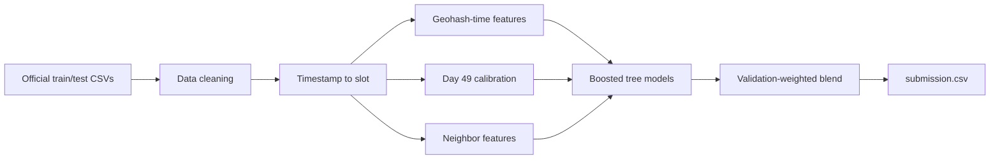
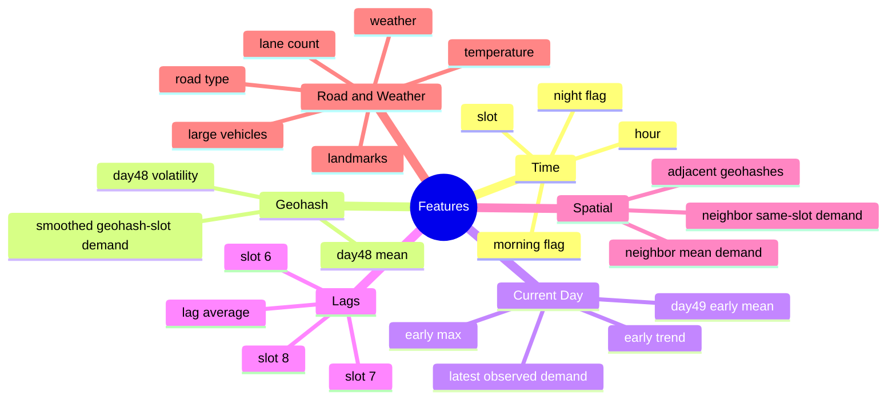

# Traffic Demand Prediction - Flipkart Gridlock


<p align="center">
  
  
  
  
</p>

## Team

**team_butterfly**

This repository contains our source code, notebook, report, and final submission for the Flipkart Gridlock traffic demand prediction task.

## Objective

Predict normalized traffic demand for future geohash-time combinations using the official train and test files. The model learns spatial, temporal, road-condition, and weather-based demand patterns, then generates `submission.csv`.

## Repository Structure

| Path | Description |
|---|---|
| `solution.py` | Main reproducible source code for feature generation, model training, blending, and submission creation |
| `traffic_demand_prediction.ipynb` | Notebook with EDA, modelling steps, and experiment notes |
| `Technical_Report.txt` | Detailed technical report covering dataset analysis, EDA, features, model, validation, and error analysis |
| `Traffic-Demand-Prediction.pdf` | Project presentation/report artifact |
| `submission.csv` | Final prediction file |
| `dataset/train.csv` | Official training data |
| `dataset/test.csv` | Official test data |
| `dataset/sample_submission.csv` | Submission format reference |
| `requirements.txt` | Python dependencies |

## Dataset Snapshot

| Item | Value |
|---|---:|
| Training rows | 77,299 |
| Test rows | 41,778 |
| Train days | Day 48 full, day 49 early slots |
| Test day | Day 49 |
| Train geohashes | 1,249 |
| Test geohashes | 1,190 |
| Target | `demand` in range `[0, 1]` |

## Approach Overview



## EDA Highlights

| Observation | Impact on Modelling |
|---|---|
| Demand is right-skewed | Predictions must avoid overestimating low-demand regions |
| Geohash is highly informative | Location-level aggregates are important |
| Time slot strongly affects demand | Slot and hour features are required |
| Day 49 early slots provide current-day context | Used for calibration and lag features |
| Nearby geohashes can share demand behavior | Spatial neighbor features improve context |
| Missing values appear in road/weather/temperature | Median filling and unknown-category handling used |

## Feature Engineering



## Model Architecture

The final solution uses a boosted-tree ensemble because the data is tabular and contains non-linear interactions between time, location, road type, weather, and same-day demand history.

| Model | Why Used |
|---|---|
| LightGBM | Fast and strong for structured tabular data |
| XGBoost | Stable boosted-tree baseline with different error behavior |
| CatBoost | Adds another tree-based learner with different regularization |

The predictions are blended using validation-based weights and clipped to `[0, 1]`.

## Validation Strategy

Random splitting was avoided because nearby timestamps and repeated geohashes are strongly correlated. Instead, the code uses a time-aware validation setup:

| Step | Description |
|---|---|
| Train split | Full day 48 |
| Validation split | Observed early slots of day 49 |
| Metrics | R2, RMSE, MAE |
| Final training | Day 48 plus observed day 49 rows |

This gives a stricter check of whether the model can transfer patterns from one day to the next.

## Error Analysis Summary

| Error Source | Reason |
|---|---|
| Sudden traffic spikes | Rare high-demand events are difficult to infer from historical patterns |
| Location drift | Some geohashes behave differently across days |
| Missing attributes | Missing road/weather/temperature values reduce row-level context |
| Spatial boundary cases | Some geohashes have fewer useful neighbors |
| Early future slots | Demand can shift quickly after the last observed day 49 slot |

## How to Run

Install dependencies:

```bash
pip install -r requirements.txt
```

Run the solution:

```bash
python solution.py
```

Output:

```text
submission.csv
```

## Key Takeaway

The strongest part of the approach is feature engineering: combining day 48 geohash-slot behavior with day 49 early calibration, same-day lag features, and neighborhood context. The boosted-tree ensemble then learns how these signals interact to estimate future demand.
